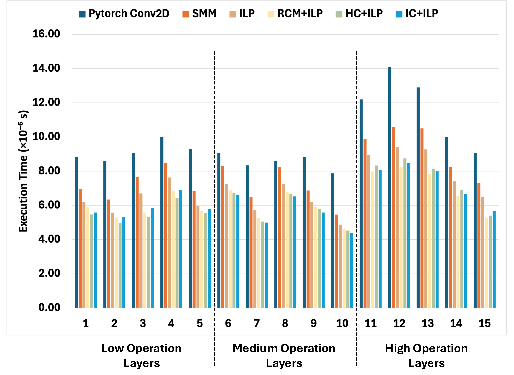
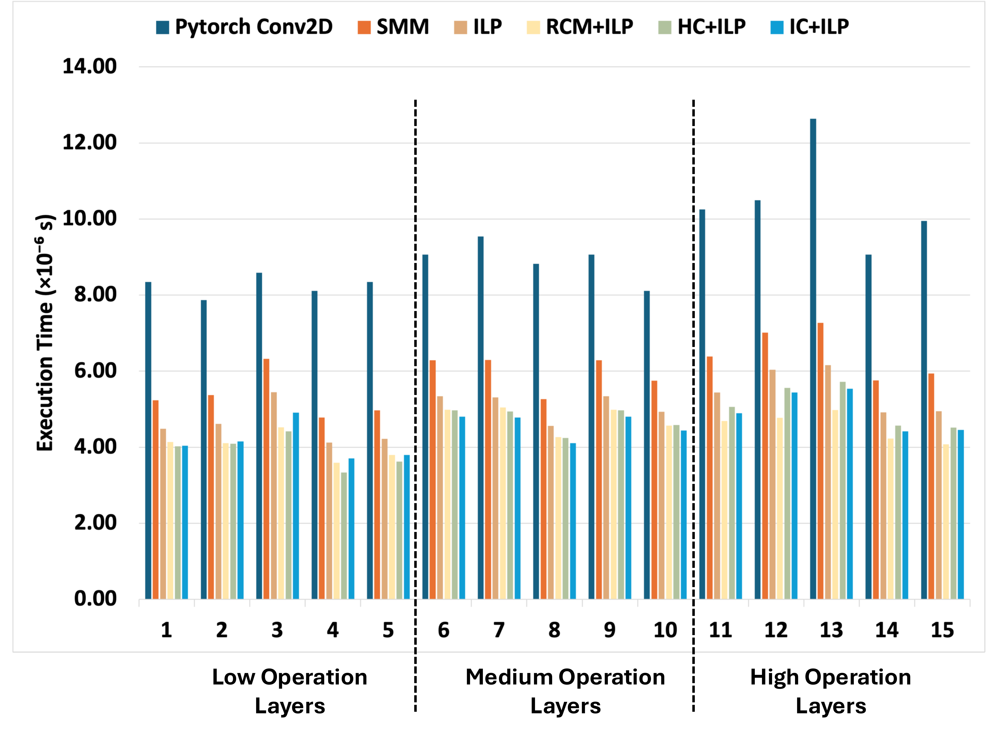

# Optimizing Deployment of Unstructured Group Convolutions for Low-Latency Inference - HiPC 2025

This repository accompanies the paper **"Optimizing Deployment of Unstructured Group Convolutions for Low Latency Inference"**,  
presented at **IEEE HiPC 2025**.

It provides:

- A **Knapsack + ILP** scheduling framework for unstructured group convolutions.
- **Matrix reordering strategies** (HC, IC, RCM) to improve data reuse and load balance.
- A **SYCL-based Scalar Matrix Multiplication (SMM)** convolution runtime.
- End-to-end and layer-wise benchmarks on **ShuffleNet** and **CondenseNet**.

---

## 📌 Optimization Techniques

| Component | Description |
|---------|-------------|
| Knapsack | Determines non-uniform group (partition) sizes |
| ILP | Assigns connections to groups for load balance |
| HC | Hierarchical Clustering–based reordering |
| IC | Iterative Clustering–based reordering |
| RCM | Reverse Cuthill–McKee bandwidth reduction |
| SMM | SYCL-based scalar matrix multiplication backend |

---

## 🧠 Method Overview

### Scheduling Pipeline
For each convolution layer:

1. Construct the **connectivity matrix** between input and output channels
2. Select optimal partition sizes using **Knapsack**
3. Assign connections using **ILP** or **Reordering + ILP**
4. Execute convolution using the **SYCL-based SMM backend**

---

## 📊 Performance Results

### ShuffleNet (Layer-wise)



### CondenseNet (CF = 4)



---

## 🔧 Prerequisites

### ✅ Python Environment

```bash
python3 -m venv ugc_env
source ugc_env/bin/activate
pip install -r requirements.txt
```

---

### ✅ System / HPC Environment

- NVIDIA GPU (tested on **A100 80GB**)
- SYCL compiler (Intel oneAPI DPC++ or equivalent)
- Gurobi Optimizer
- Linux with CUDA support

---

## ⚙️ Scheduling and Execution

Scheduling is performed **offline once per model** using Knapsack + ILP.  
The optimized schedule is reused for all subsequent inferences.

The convolution execution replaces PyTorch `Conv2d` with a **SYCL-based SMM kernel**, while preserving numerical correctness.

---

## 🧪 Evaluated Models

| Model | Notes |
|------|------|
| ShuffleNet | Fixed group structure |
| CondenseNet | Condense Factors = 1, 2, 4, 8 |

Layers are categorized into **low**, **medium**, and **high** operation groups based on `Cin × Cout`.

---

## 📁 Project Structure

```text
.
├── figures/                  # 📈 Figures used in README
│   ├── pipeline.png
│   ├── shufflenet_layers.png
│   └── condensenet_cf4.png
│
├── scheduling/               # Knapsack + ILP scheduler
├── reordering/               # HC / IC / RCM implementations
├── runtime/                  # SYCL-based SMM convolution
├── benchmarks/               # Model benchmarks
├── scripts/                  # Reproducibility scripts
└── README.md                 # You are here
```

---

## 📈 Results Summary

- Up to **1.9× speedup** over PyTorch Conv2D
- **IC + ILP** achieves the best performance across all models
- Reordering provides up to **1.3× improvement** over ILP alone
- **No Top-1 accuracy degradation**

---

## 📚 Citation

If you use this work, please cite:

```bibtex
@inproceedings{li2025unstructured,
  title={Optimizing Deployment of Unstructured Group Convolutions for Low Latency Inference},
  author={Li, Changxin and Kuppannagari, Sanmukh},
  booktitle={IEEE International Conference on High Performance Computing, Data, and Analytics (HiPC)},
  year={2025}
}
```

---

## 📬 Contact

- Changxin Li — cxl1492@case.edu  
- Sanmukh Kuppannagari — sanmukh.kuppannagari@case.edu

---

## 📄 License

MIT License

